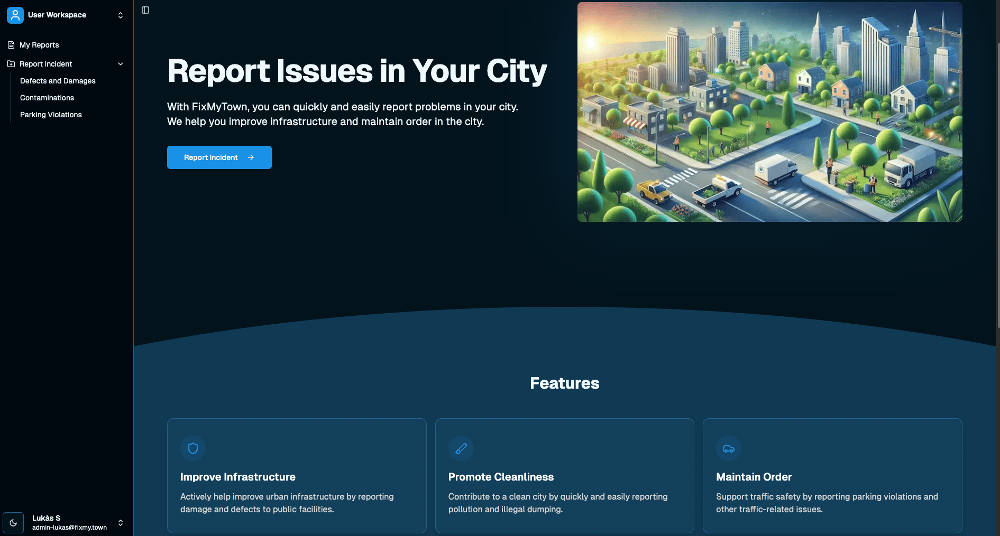
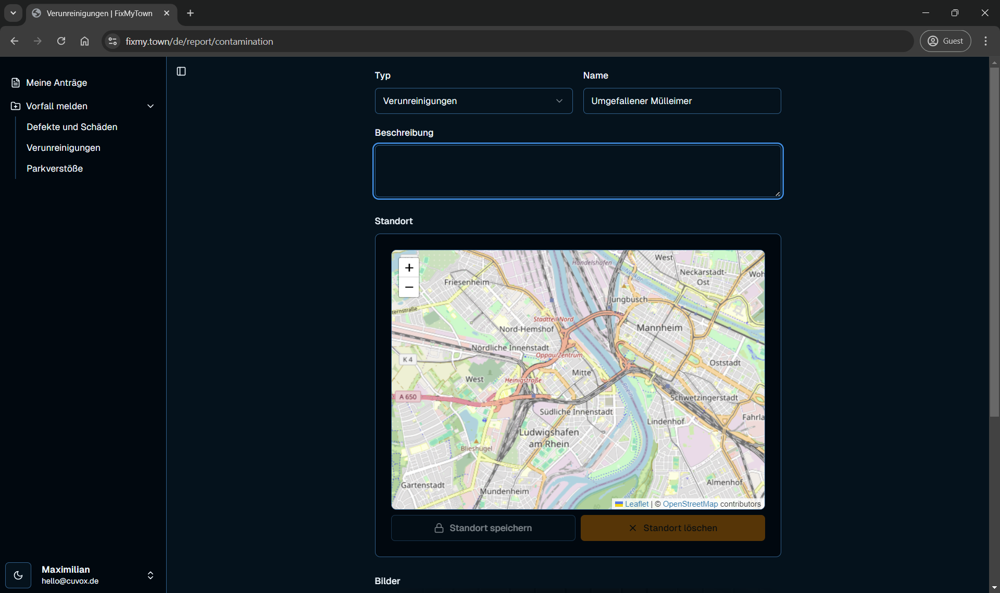
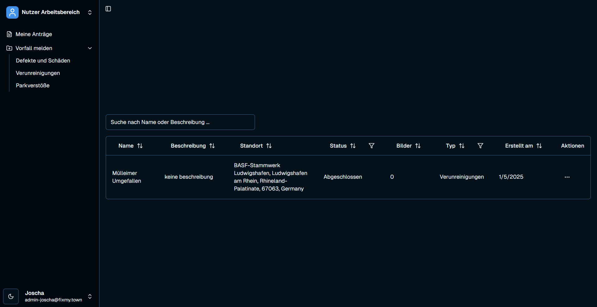
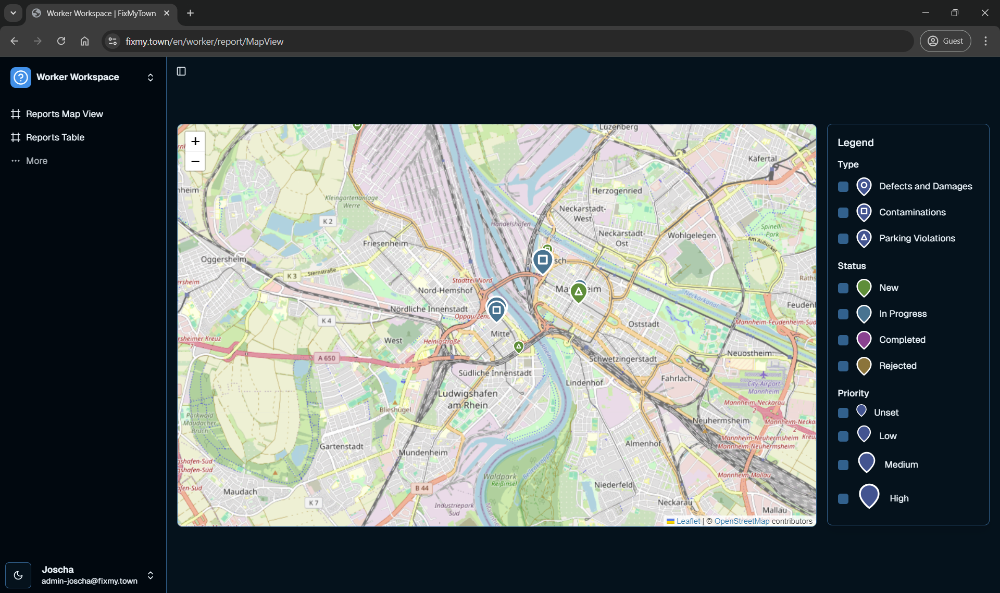
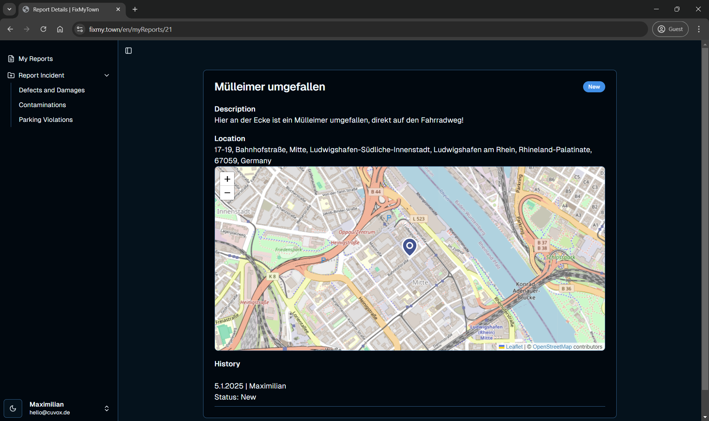
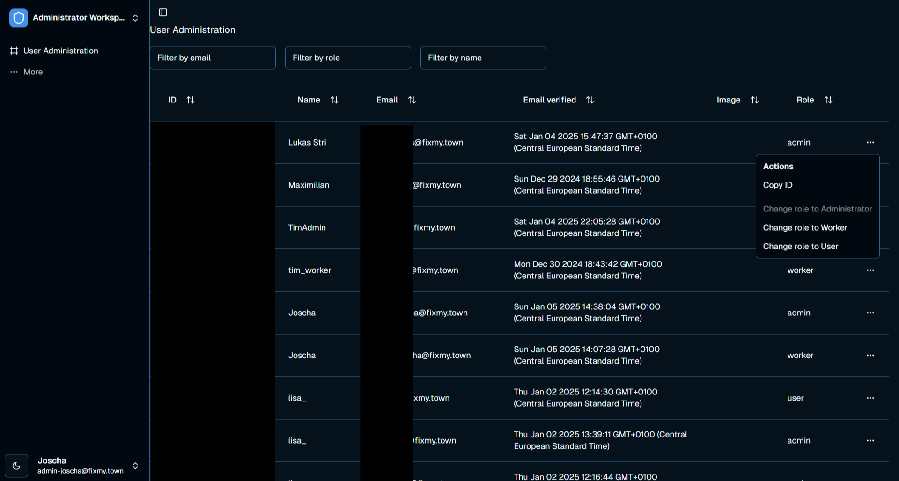

# FixMyTown 🏙️

> **Educational Project Disclaimer:** This project was developed as part of a university course at HWG Ludwigshafen. While it implements some production-grade practices and features, it is primarily for educational purposes. Use in production environments should be done with proper security audits and modifications.

FixMyTown is a modern web application that enables citizens to report and track infrastructure issues in their city. Built with Next.js 14, TypeScript, and a robust tech stack, it provides a seamless experience for both citizens and city workers to manage urban infrastructure problems.

## 🎯 Core Features

### For Citizens
- Quick and easy problem reporting with image uploads
- Real-time status tracking of submitted reports
- Email notifications for status updates
- Report management (create, delete, track)
- Multilingual support (German/English)

### For City Workers
- Comprehensive issue management dashboard
- Status updates and commenting system
- Report filtering and export capabilities
- Priority management

### For Administrators
- User role management
- System monitoring
- Access control

## 📸 Screenshots

<details open>
<summary>Landing Page (`/`)</summary>


</details>

<details>
<summary>Reporting Page (`/report`)</summary>


</details>

<details>
<summary>My Reports Overview (`/myReports`)</summary>


</details>

<details>
<summary>Worker Map View (`/worker/report/MapView`)</summary>


</details>

<details>
<summary>Worker Report Details View (`/report/details/[id]`)</summary>


</details>

<details>
<summary>Admin User Management (`/admin/userAdministration`)</summary>


</details>


## 🛠️ Tech Stack

### Frontend
- [Next.js 14](https://nextjs.org) - React Framework
- [TailwindCSS](https://tailwindcss.com) - Styling
- [Shadcn/UI](https://ui.shadcn.com) - UI Components
- [React Email](https://react.email) - Email Templates

### Backend & Database
- [tRPC](https://trpc.io) - Type-safe API
- [Turso](https://turso.tech) - Database
- [Drizzle ORM](https://orm.drizzle.team) - Database ORM
- [NextAuth.js](https://next-auth.js.org) - Authentication

### Infrastructure
- [Vercel](https://vercel.com) - Hosting
- [Uploadthing](https://uploadthing.com) - File Uploads
- [Resend](https://resend.com) - Email Service

### Quality Assurance
- TypeScript - Type Safety
- Vitest - Unit Testing
- Playwright - E2E Testing
- ESLint - Code Quality
- Prettier - Code Formatting

## 📋 Project Structure

```bash
FixMyTown/
├── .github/
│   └── workflows/    # CI/CD workflows
├── docs/             # Documentation
│   ├── screenshots/  # Screenshots
│   ├── showcase/     # Project demos
│   └── workflows/    # Process diagrams
├── drizzle/          # Database migrations
├── public/           # Static assets
├── src/
│   ├── app/          # Next.js app router
│   ├── components/   # React components
│   ├── dictionaries/ # i18n dictionaries
│   ├── emails/       # Email templates
│   ├── hooks/        # React hooks
│   ├── lib/          # Utility functions
│   ├── server/       # Server-side code
│   ├── styles/       # Global styles
│   ├── tests/        # Test files
│   └── trpc/         # tRPC setup
├── .env              # Development Env
└── .env.test         # Test Env
```

## 🚀 Getting Started

### Prerequisites
- Node.js 18+
- pnpm (recommended) or npm
- Git
- A [Turso](https://turso.tech/) account
- A [Resend](https://resend.com/) account
- An [Uploadthing](https://uploadthing.com/) account
- [Excalidraw](https://excalidraw.com/) (free, no account needed) or [VS Code Extension](https://marketplace.visualstudio.com/items?itemName=pomdtr.excalidraw-editor) to view documentation diagrams


### Installation Steps

1. **Clone and Install**
```bash
git clone https://github.com/LukasStrickler/FixMyTown.git
cd FixMyTown
npm i
```

2. **Environment Setup**
```bash
cp .env.example .env
cp .env.test.example .env.test
```

3. **Configure Services**
- Database: Create a Turso database and set `DATABASE_URL` and `DATABASE_AUTH_TOKEN`
- Email: Get `RESEND_API_KEY` from Resend and configure `RESEND_FROM`
- Storage: Set up `UPLOADTHING_TOKEN` from Uploadthing

4. **Initialize Database**
```bash
npm run db:push
npm run db:push:test
```

5. **Start Development**
```bash
npm run dev
```


## 📱 Mobile Support

The application is fully responsive and optimized for both desktop and mobile devices.
Features include:
- Responsive design for all screen sizes
- Touch-friendly interface
- Native mobile app version (FixMyTown-Go) (see [Roadmap](#️-roadmap))

## 🔒 Security

- Email-based authentication with magic links
- Role-based access control
- CSRF protection
- Rate limiting
- Input validation and sanitization
- Secure file upload handling

## 👥 Team

- **Paul Klarer** - UI & Documentation
- **Joscha Stähle** - Developer
- **Lisa Sterner** - Workflows & Documentation
- **Lukas Strickler** - Lead Developer
- **Tim Strohmenger** - Developer

## 🤝 Contributing

While this is primarily an educational project, contributions are welcome! Please:

1. Clone the repository to your GitHub account
2. Create a descriptive feature branch (e.g., `git checkout -b feature/add-map-filters`)
3. Make your changes and commit them with clear messages (e.g., `git commit -m 'Add filters for map markers'`) 
4. Push your changes to your fork (`git push origin feature/add-map-filters`)
5. Open a Pull Request against our main branch
6. Provide a detailed description of your changes and include screenshots/recordings where helpful

## 📄 License

This project is licensed under the MIT License - see the [LICENSE](LICENSE) file for details.

## 📞 Contact

* **Paul Klarer** - [GitHub](https://github.com/paulKlarer) 
* **Joscha Stähle** - [GitHub](https://github.com/joscha-st)
* **Lisa Sterner** - [GitHub](https://github.com/sternlis) 
* **Lukas Strickler** - [GitHub](https://github.com/LukasStrickler) | [Website](https://lukasstrickler.com)
* **Tim Strohmenger** - [GitHub](https://github.com/Timbo003) | [Website](https://www.tim-strohmenger.de)

## 🙏 Acknowledgments

- [HWG Ludwigshafen](https://www.hwg-lu.de/) for providing this project as part of our studies
- All open-source projects that made this possible
- Our beta testers

## 📈 Performance 
Measued  on M1 Mac (2020)
- Lighthouse score: 90+ on all metrics
- Core Web Vitals compliant
- First Contentful Paint < 1s
- Time to Interactive < 3.5s

## 🧪 Testing

### Unit & Component Tests
```bash
# Run tests
npm run test

# Run tests with UI
npm run test:ui

# Run tests with coverage
npm run test:coverage

# Run tests in watch mode
npm run test:watch
```

### Performance & Lighthouse Tests
```bash
# Run Lighthouse tests
npm run test:lighthouse

# View Lighthouse report
npm run test:lighthouse:report
```

The testing setup includes:

- **Unit & Component Testing**
  - Vitest with React Testing Library
  - Interactive UI mode available
  - Coverage reporting with v8
  - Watch mode for development

- **Performance Testing**
  - Lighthouse integration
  - Performance metrics tracking
  - Accessibility audits
  - Best practices verification
  - SEO optimization checks

- **Continuous Integration**
  - Automated testing on GitHub Actions
  - Test database configuration (`npm run db:push:test`)
  - Environment variable management

## 📦 Dependencies

### Core
- Next.js 14
- React 18
- TypeScript 5

### Database & API
- tRPC
- Turso
- Drizzle ORM

### UI & Styling
- TailwindCSS
- Shadcn/UI
- React Email

## 🗺️ Roadmap

- [ ] Native mobile app (FixMyTown-Go)
- [ ] Real-time notifications
- [ ] Analytics dashboard
- [ ] AI-powered issue categorization

## 💬 Support

- For bug reports, please [create an issue](https://github.com/LukasStrickler/FixMyTown/issues) and add the `#dev-bug` label
- For feature requests, please [create an issue](https://github.com/LukasStrickler/FixMyTown/issues) and add the `#dev-feature` label


---

<p align="center">Made with ❤️ at HWG Ludwigshafen</p>